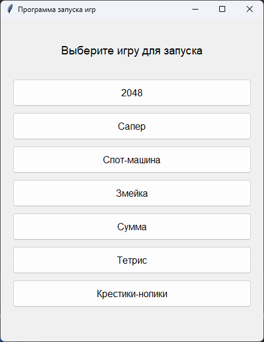
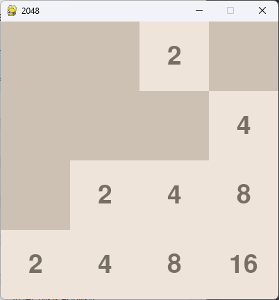
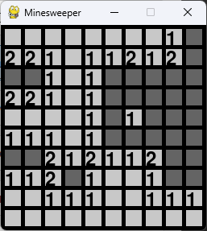
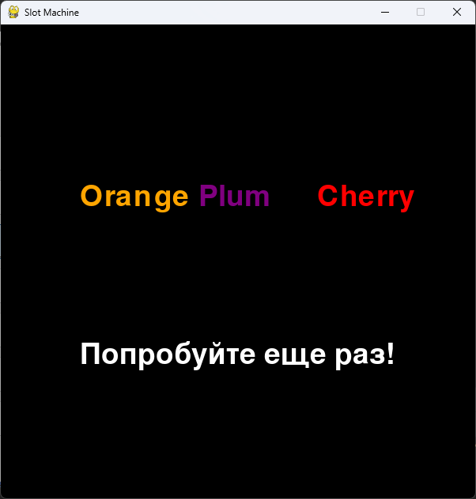
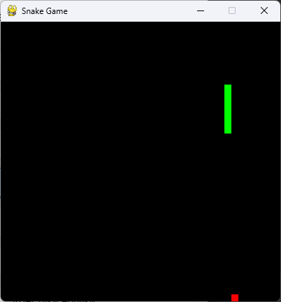
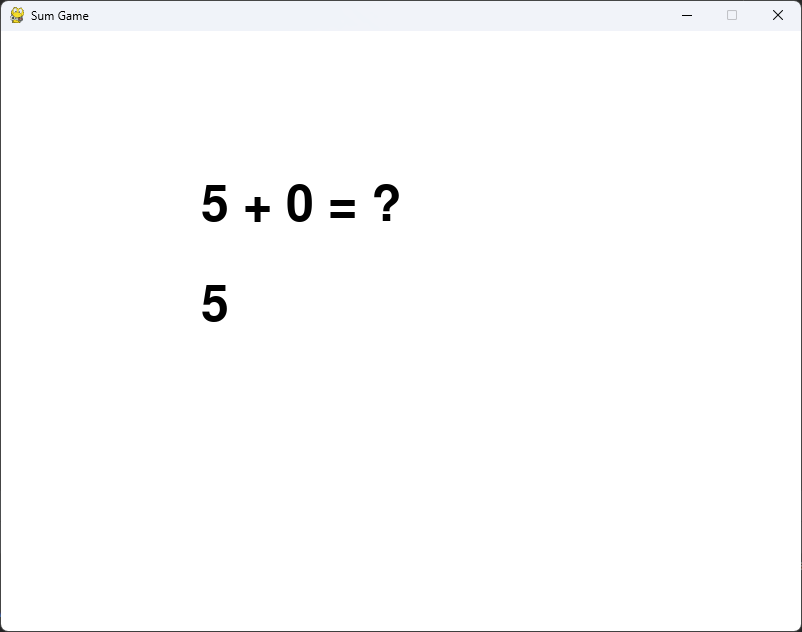
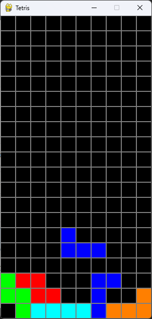
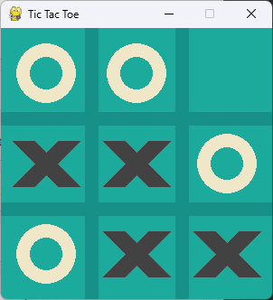

# Mini Games Collection

Eng | [Rus](resources/localization_readme/README_RU.md)

## Description

A small collection of mini-games. Implemented using Pygame, such games are included:

* Tic-tac-toe;
* Slot machine;
* Snake;
* Minesweeper;
* Tetris;
* Numbers;
* 2048.

### License

```text
MIT License
```

## Screenshots
















